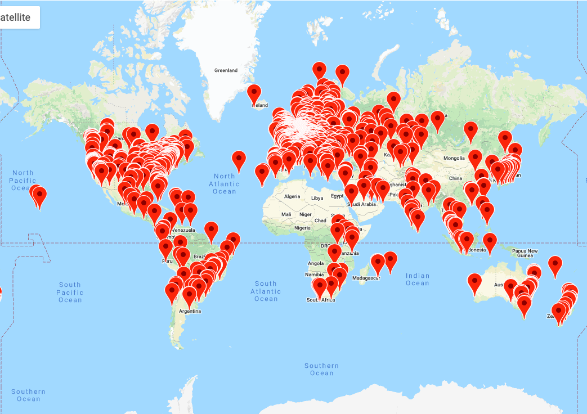
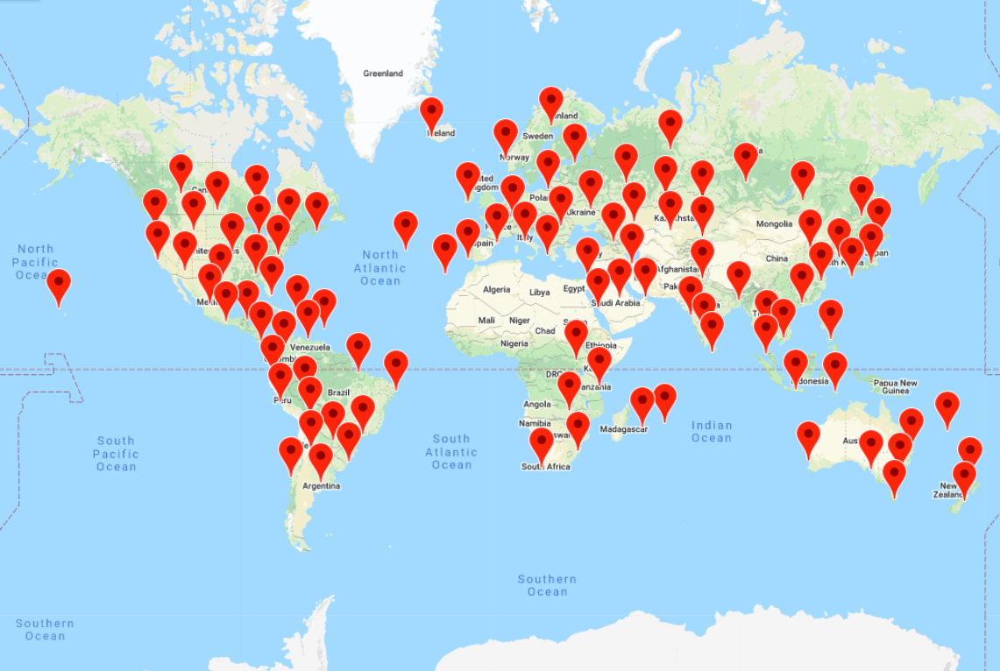

# Probe Filters
When conducting measurements with the Ripe-Atlas platform, it is often desirable 
to use a diverse set of probes. Within probeFilters.py, you will find functions for selecting Ripe-Atlas probes based on geographic and ASN diversity. 
This can be used for selecting a diverse subset of probes from a larger group that contains certain tags (for example, "system-ipv4-works" and "system-ipv6-works" to consider only dual-stack probes). Or, if you already have a list of probe ids, and would like to select the most geographically diverse probes from that group, that is supported here as well. Examples of both of these applications are included in exampleUsage.ipynb
## Effectiveness
To show how our algorithm is able to effectively select a diverse set of probes, we start with a set of over 3000 probes, shown below. These are all of the dual-stack probes with recent hardware (v3, v4, anchor), selected by tag.

Then, we use our algorithm to select the 100 most geographically diverse probes from this set, below.

## Algorithm

Below is the algorithm for selecting the k most geographically diverse probes from a set of n probes. It is a greedy process that would runs O(nk) time, and tends to find a good solution (though it may not be optimal). 

The first probe is selected arbitrarily. Then repeat the following steps until all k probes are chosen:
1. For each probe not yet selected, find its nearest neighbor out of probes that have already been selected. 
2. Select the probe with the maximum distance to its nearest neighbor. 

For smaller values of n, it may be necessary to enumerate all possible starting probes, and choose the one which results in the most diversity. However, with larger n, this would greatly increase runtime and tend to make little difference. 
